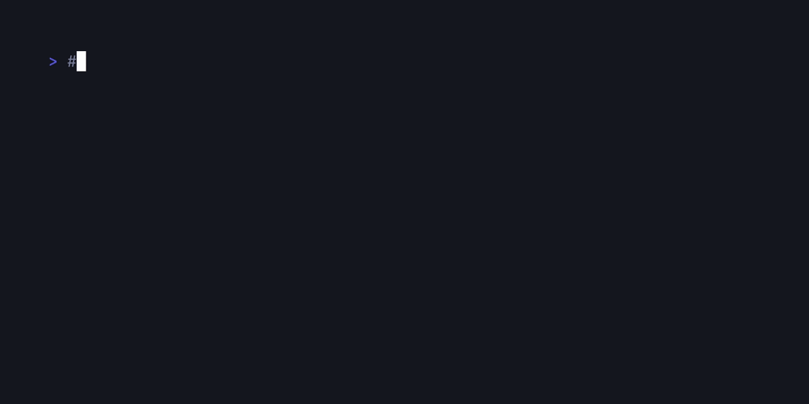

# Hawk

Dead simple rust CLI to ease workflows management inside monorepos.



## Installation

You can install `hawk` via cargo (homebrew coming soon) or by downloading the [latest binary](https://github.com/Rawnly/hawk/releases/latest)

```sh
cargo install hawk-cli
```

## Usage

Run `hawk init` to initialize an empty config file. With the `--read-from-env` flag `hawk` will try to
retrive your `workspaces` from `pnpm-workspace.yaml` or `pacakge.json` workspaces key.
~You can also pass `--json` if you want to save the config file as json.~

```bash
hawk 0.1.4

USAGE:
    hawk [OPTIONS] [SUBCOMMAND]

OPTIONS:
    -c, --config <CONFIG>    Specify the config file path
    -h, --help               Print help information
        --scope <SCOPE>      Specify which workspaces files copy / watch Usage: --scope
                             <workspace-name>
    -V, --version            Print version information

SUBCOMMANDS:
    clean    Delete generated files
    copy     Copy files to the `target` directory
    help     Print this message or the help of the given subcommand(s)
    init     Initialize a repository
    list     List workflows in the `target` directory
```

## Example

> Check out the [example](./example) folder.

Below an example monorepo situation:

```sh
example
├── hawk-config.yaml
├── .github
│   └── workflows
│       ├── my-second-app--deploy.yml # name generated by folder
│       └── the-app--deploy.yml # name is read from package.json
└── packages
    ├── my-app
    │   ├── .DS_Store
    │   ├── package.json // reads workspace name from package.json (the-app)
    │   └── .github/workflows
    │       └── deploy.yml
    └── my-second-app
        └── .github/workflows
            └── deploy.yml
```

```bash
    $ cd example
    $ hawk --watch
    ... let the magic happen
```

## Why

[Github actions don't yet support workflows inside subfolders](https://github.com/orgs/community/discussions/18055#discussioncomment-3703595), neither in your `.github/workflows/` folder or project custom folders.
So I made `hawk` to solve this problem without using custom commands. It lets you copy workflows from custom paths and paste them with a prefix, handling most of the pain.
With 10 lines config you have a working monorepo setup.

## Installation

Download the [latest release](https://github.com/rawnly/hawk/releases/latest) and move in your `$PATH`

### From source

make sure to have your rust environment ready, then:

- Clone the repo
- Run `cargo build -r` or `make build`
- Copy `target/release/hawk` to your path or use `sudo make install` (it will copy the bin into `/usr/local/bin`)
- Enjoy

## Setup

To setup a new project just run `hawk init`. If you're in a `node` environment you can pass the `--read-from-env` flag to generate config based on the monorepo configuration.

## Features

- [x] File watching
- [x] Cleanup `workflows` folder from generated files.
- [x] Custom configuration
- [x] Generate config from `pnpm-workspace.yaml` and yarns `package.json:workspaces`
- [ ] Create an action to automate this process. (so the user can update a workflow, push and get the generated one updated automatically)
